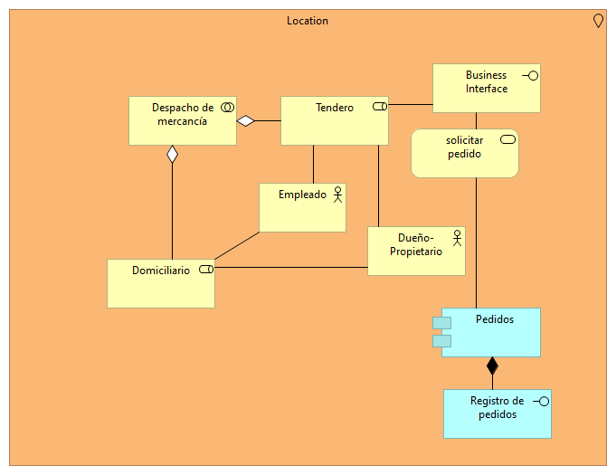

# MICROTIENDA CON MICROSERVICIOS (Microservices Shop) :calling:
Este ejercicio muestra a grandes rasgos la implemetación de una arquitectura de microservicios de una tienda pequeña, que dispone de:

* Gestión de inventarios (estático)
* Gestion de clientes (estático)
* Registrar el pedido (Queda registrado que x persona hizo un pedido a y tendero)
como microservicios. 

Para poner en funcionamiento esta implementación siga las siguientes instrucciones:

1. Considere la instalación de docker y nginx.
2. Ubiquese sobre la carpeta donde clono o descargo la información del repositorio y abra el cmd. Escriba "docker-compose up"
3. Dirijase a un navegador y consulte la información mediante http://localhost:8080/clientes y http://localhost:8080/inventario
4. Verá la  información de Gestión de inventarios y Gestión de clientes

Esta implementación tuvo un procedimiento previo que consideró el diseño de la arquitectura de la aplicación, que seexplicará a continuación.

# MODELADO DE ARQUITECTURA :pencil:

Se subraya que "El diseño crea una representación o modelo del software, pero, a diferencia del modelo de los requerimientos (que se centra en describir los datos que se
necesitan, la función y el comportamiento), **el modelo de diseño proporciona detalles sobre arquitectura del software, estructuras de datos, interfaces y componentes que
se necesitan para implementar el sistema."**

Según esto se ha realizado un trabajo de arquitectura de software en el que según la comprensión del negocio, infraestructura y funcionamiento se generaron las siguientes vistas:

## Vista de Organización
Este punto de vista muestra los actores (tenderos, tienda, dueño ) y sus relaciones en el negocio, que considera por un lado la venta de productos por internet (a domicilio) y por otro lado el despacho de mercancía de productos en la tienda. 


## Actor-Cooperación 
Este punto de vista extiende el punto de vista anterior, determinando relaciones externas y colaboraciones, muestra las redes sobre la que operan los actores. La pagína web expondría un servicio. Por eso, se observa  un servicio que se llama **solicitar pedido** asociado a la página web. Además se puede modelar la interfaz del servicio que modela el rol de negocios del tendero que se llama **registro de pedidos** ofertada por un componente de aplicación denominada **pedidos** (Relación de composición). Se deja a nivel de negocio y se muestra la colaboración de actores y cómo se ve realizada esta colaboración entre actores para el despacho de pedidos por medio de la página web.


## Vista de Funciones del Negocio
Se manejan los roles asociados a unas funciones.


## Vista de Aplicación


## Vista de Capas


## Vista de componentes


## Vista de Contribución de Objetivos


## Vista de Cooperación de proceso de negocio


## Vista de Estructura de información


## Vista de Estructura de aplicación


## Vista de Infraestructura


## Vista Motivacional


## Vista de Implementación


## Vista de Productos


## Vista de Realizacion Requerimientos


## Vista de Uso de Infraestructura


## Vista de Uso de Aplicación


## Vista de Venta Productos


## Explicación general del Código que se presenta

```

```
## Explicación general del Código que se presenta :scroll:

Nestor Camilo Beltrán 20202099021
Edda Camila Rodríguez Mojica 20202099033
